<p align="center">
  <picture>
    <source media="(prefers-color-scheme: dark)" srcset="docs/screenshots/logo-dark.png">
    
  </picture>
</p>

<h3 align="center">Resin planning for the blown film floor</h3>

<p align="center">
  Plan hopper run-downs, set up recipes and receiver weights,<br>
  and keep one live job in step across every device on the line.
</p>

<p align="center">
  <a href="https://resin.tools"></a>
  
  
  
  
  
</p>

<p align="center">
  <picture>
    <source media="(prefers-color-scheme: dark)" srcset="docs/screenshots/desktop-dark.png">
    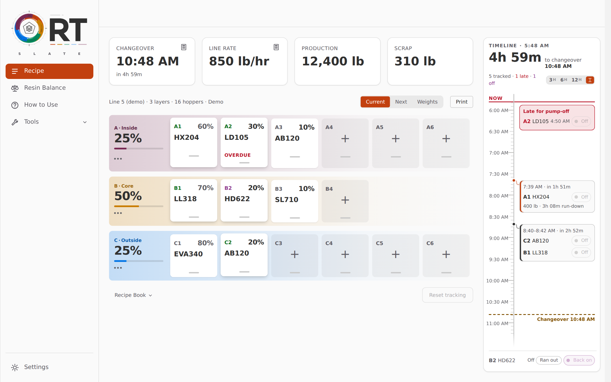
  </picture>
</p>

**Slate** is the current interface of [Resin.tools](https://resin.tools). It is the default view on desktops and floor tablets, and runs as a presentation layer over the same application as the original floor UI: one app, one Supabase connection, one RT Sync session.

<sub>Screenshots are from Slate's demo page ([`slate/slate.html`](slate/slate.html)) with its sample line.</sub>

---

## ✨ What Slate does

| | Section | What it's for |
| :---: | --- | --- |
| 🧪 | **Recipe** | The line's layers and hoppers as a draft: resin search from the shared catalog, blend percentages with Hopper 1 derived from Hoppers 2–6, bulk edit, drag-and-drop rearrangement with Undo / Cancel / Done, and Rows or Columns layouts. |
| ⚖️ | **Weights** | Receiver hopper weights by physical position, kept separate from the recipe. |
| 📖 | **Recipe Book** | Shared Recipes and Receiver Weight Profiles for the workspace. Load with a preview of what will and won't change, then save, update, rename, duplicate, favorite or delete. |
| ⏱️ | **Timeline** | The run-down to the next changeover, with tracking, pump-off, and correction of a hopper that ran out early. |
| 📊 | **Resin Balance** | Resin totals for the job, with production and scrap entry. |
| 🧮 | **Tools** | Formulas (lb per 1,000 ft, unit conversions, product density, working back from a weighed set), Winding Tension, Work Alarm, changeover and line-rate estimates. |
| 🔄 | **RT Sync** | Join a line by code or QR, see linked devices, resolve conflicts in Slate's own dialog. |
| 🛡️ | **Admin** | Workspaces, Line Configuration, Resin Database, for verified administrators only. |
| 🎨 | **Settings** | Nine theme families, each with a light and a dark half; backgrounds; layouts; view and input preferences. |

<table>
  <tr>
    <td width="33%">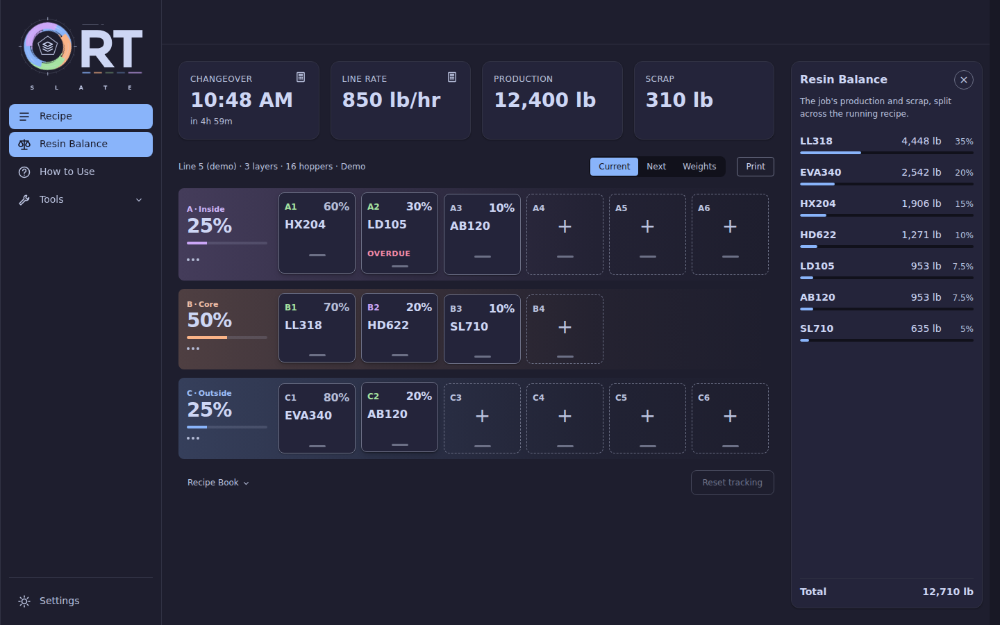</td>
    <td width="33%">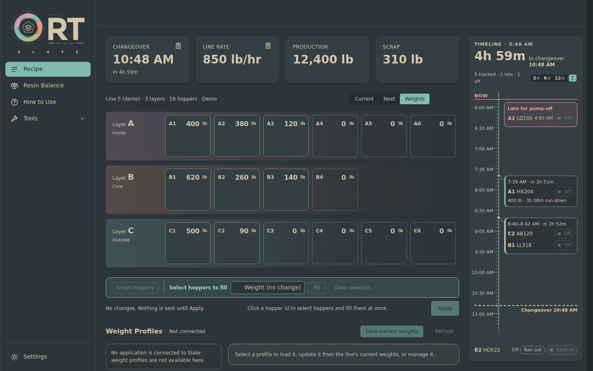</td>
    <td width="33%">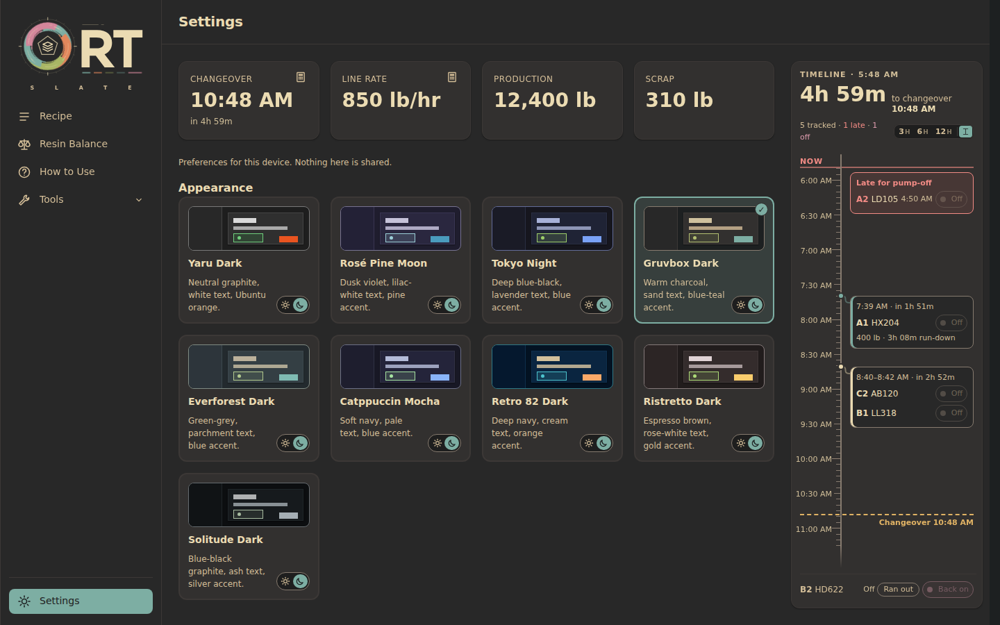</td>
  </tr>
  <tr>
    <td align="center"><b>Resin Balance</b> · Catppuccin</td>
    <td align="center"><b>Weights</b> · Everforest</td>
    <td align="center"><b>Settings</b> · Gruvbox</td>
  </tr>
</table>

## 📱 Desktop, tablet and phone

Slate draws for three tiers ([`slate/slate-tier.js`](slate/slate-tier.js)): mouse desktop, touch tablet (both orientations, gloved operators) and phone.

<table>
  <tr>
    <td width="60%">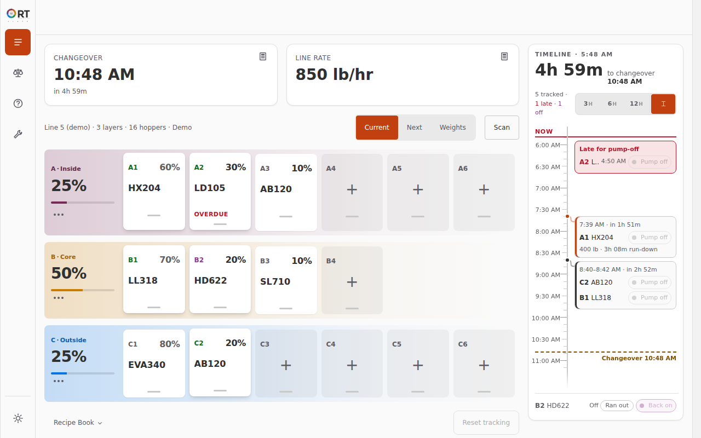</td>
    <td width="20%">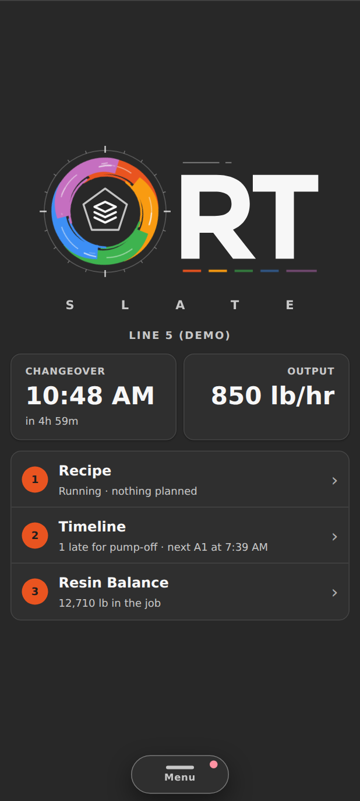</td>
    <td width="20%">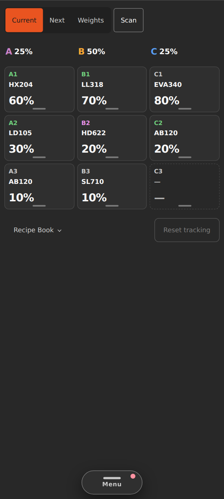</td>
  </tr>
  <tr>
    <td align="center"><b>Tablet</b> · bigger touch targets, drawer timeline</td>
    <td align="center"><b>Phone</b> · home</td>
    <td align="center"><b>Phone</b> · recipe</td>
  </tr>
</table>

Design notes and implementation logs: [`slate/TABLET-PLAN.md`](slate/TABLET-PLAN.md), [`slate/MOBILE-PLAN.md`](slate/MOBILE-PLAN.md).

## 🎨 Themes

Catppuccin · Everforest · Gruvbox · Retro 82 · Ristretto · Rosé Pine · Solitude · Tokyo Night · Yaru, each in light and dark.

<table>
  <tr>
    <td>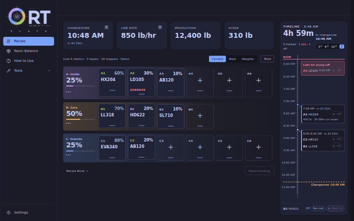</td>
    <td>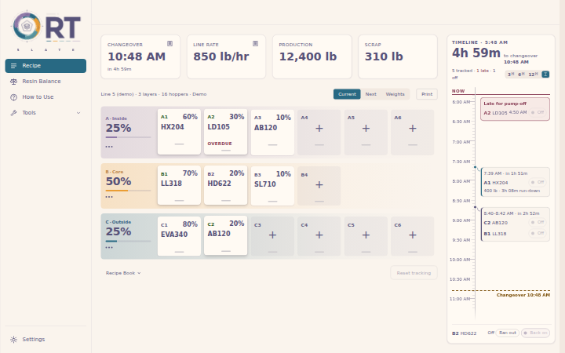</td>
    <td>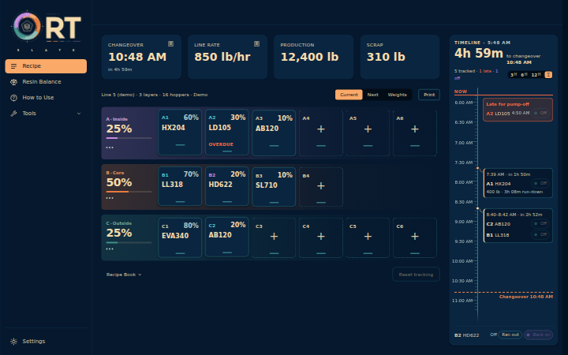</td>
  </tr>
  <tr>
    <td align="center">Tokyo Night</td>
    <td align="center">Rosé Pine Dawn</td>
    <td align="center">Retro 82 Dark</td>
  </tr>
  <tr>
    <td>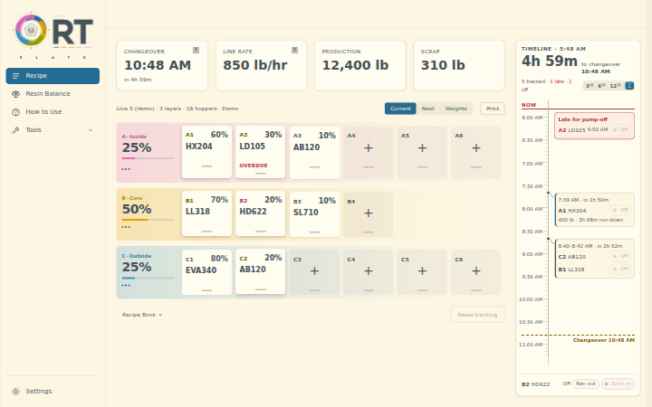</td>
    <td>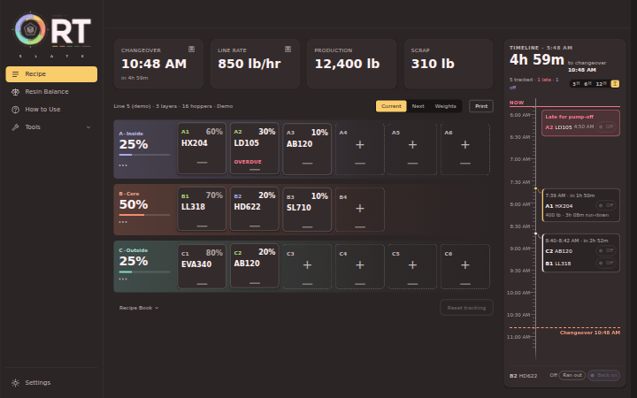</td>
    <td>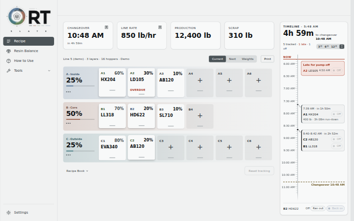</td>
  </tr>
  <tr>
    <td align="center">Everforest Light</td>
    <td align="center">Ristretto Dark</td>
    <td align="center">Solitude Light</td>
  </tr>
</table>

## 🧭 Which view you get

All views are the same document ([`index.html`](index.html)); [`slate-host.js`](slate-host.js) picks the presentation and loads Slate's files only when Slate is the view.

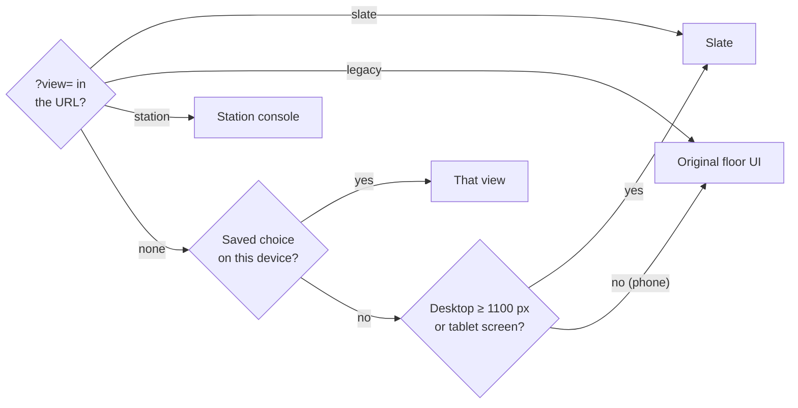

Phones can opt in from the floor UI's **Slate (Beta)** link and then Slate's Settings.

## 🏗️ How it fits together

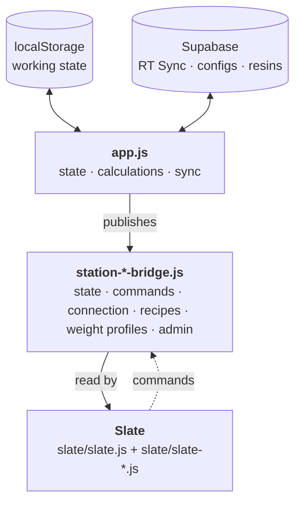

- **The application is the only writer.** Slate subscribes to the bridges as an ordinary consumer and changes state only by sending commands through the command bridge; it never reaches into the floor UI's DOM.
- **Slate's modules** live in [`slate/`](slate/), one file per section or tool, booted by [`slate/slate.js`](slate/slate.js). Styles and themes are in [`slate/styles/`](slate/styles/).
- **Demo page.** [`slate/slate.html`](slate/slate.html) loads Slate without `app.js` and falls back to a sample line ([`slate/slate-demo.js`](slate/slate-demo.js)). It's for layout work, not live data.
- **Shared services** are used unchanged: `PolynResinCatalog` ([`resin-catalog-service.js`](resin-catalog-service.js)), `PolynWorkspaceConfigurations` ([`workspace-configurations-service.js`](workspace-configurations-service.js)) and `PolynWorkspaceConfigurationPayloads` ([`workspace-configuration-payloads.js`](workspace-configuration-payloads.js)). The `Polyn` prefix on globals and storage keys is historical and kept for compatibility.

## 🧱 What belongs to a hopper

Each hopper carries three separate concerns, and each kind of saved document touches only its own:

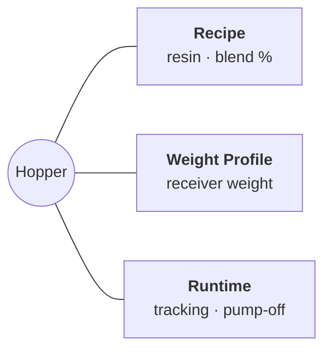

- Loading a **Recipe** never touches receiver weights or runtime state. Unknown or inactive resin codes stay loadable as typed.
- Loading a **Receiver Weight Profile** changes only weights.
- **Runtime state** (tracking, pump-off, timeline, sync outbox, device identity) belongs to neither.
- Hopper 1's percentage is always `100 − (H2 … H6)`.

[`CLAUDE.md`](CLAUDE.md) is the full project guide and the source of truth for these rules.

## 🚀 Running locally

```sh
npm run serve          # http://127.0.0.1:8080  (no-store static server, no build step)
```

Then open `http://127.0.0.1:8080/?view=slate`, or `slate/slate.html` for the demo page.

The Android app is a Capacitor shell around the same files (`npm run sync:android`, see [`capacitor.config.json`](capacitor.config.json)); the GitHub Pages site doesn't use it.

<details>
<summary><b>☁️ Backend setup (optional)</b></summary>

<br>

Browser `localStorage` is always the immediate working state. Supabase adds RT Sync, shared configurations, the resin catalog and admin tooling; without it the app runs local-only.

1. Create a Supabase project and enable anonymous sign-ins.
2. Apply [`supabase/migrations`](supabase/migrations) in filename order (`supabase db push`).
3. Set the project URL and **publishable** key in [`supabase-config.js`](supabase-config.js). Never put a service-role key in this repository.
4. Edge Functions live in [`supabase/functions`](supabase/functions) (`recipe-scan`, `rt-cloud`, `database-health`).

See [`supabase/README.md`](supabase/README.md) for the migration ledger, RT Sync RPCs, resin administration and admin-assisted workspace recovery.

</details>

## ✅ Tests

```sh
node --test tests/*.test.js
git diff --check
```

Tests live in [`tests/`](tests/) and run from the repo root; Slate's are the `slate-*.test.js` files. SQL behavior is covered by source-level contract tests (`*-schema.test.js`).
